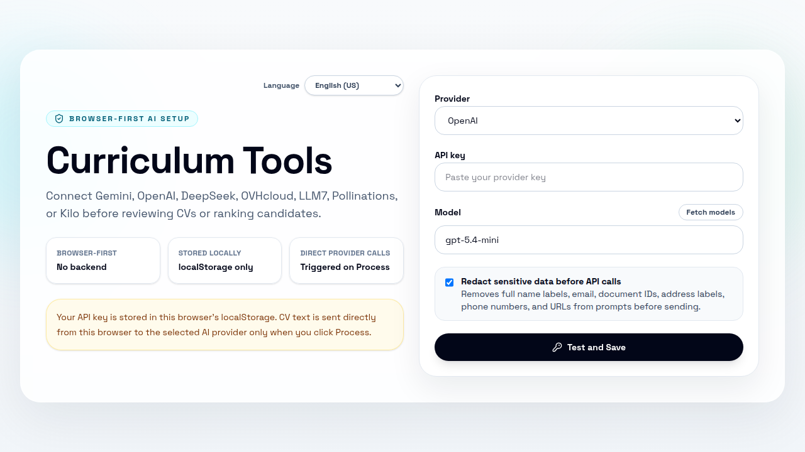
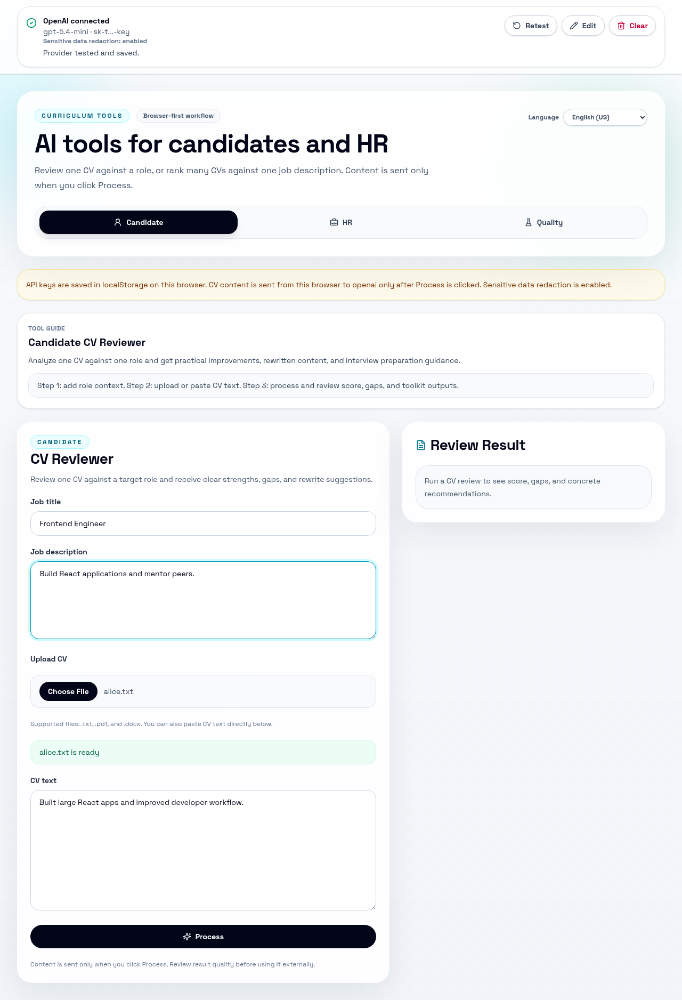
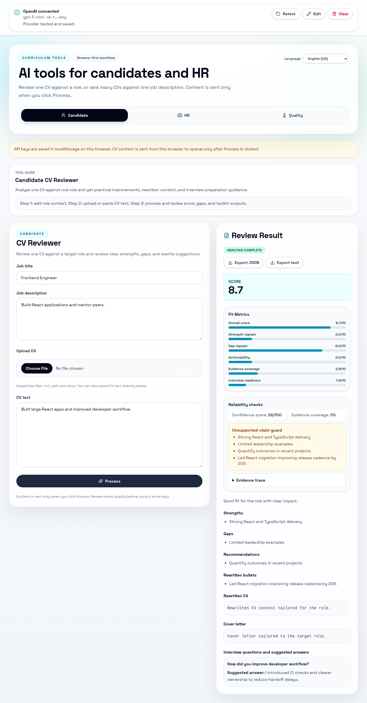
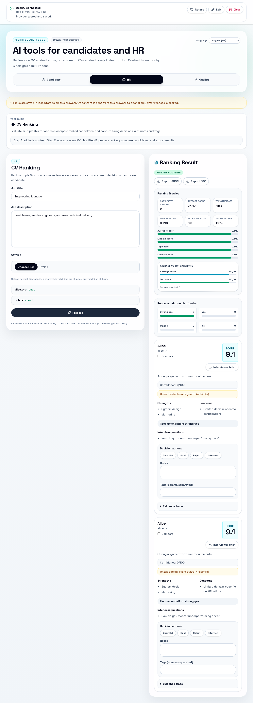
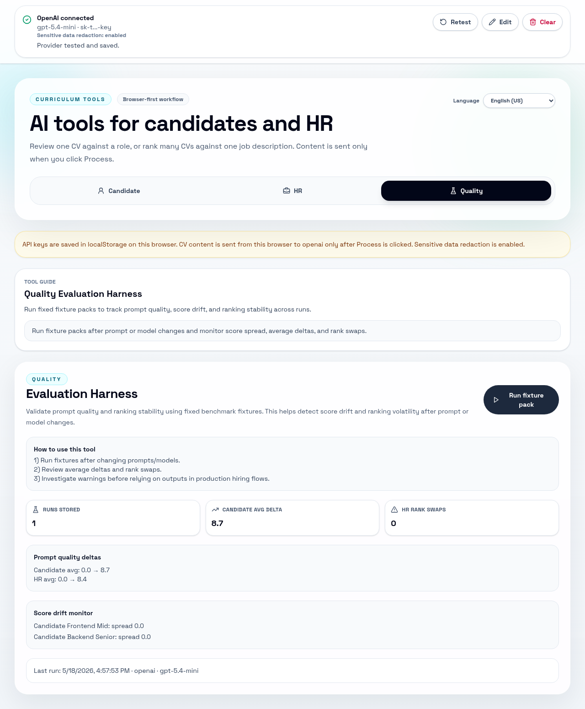

# Curriculum Tools

Browser-first AI tools for candidates and HR teams. Users can connect key-based providers or anonymous free providers, validate in the app, and then process CVs directly from the browser.

## Live Demo

Test the app live on GitHub Pages: https://paulorobertouri.github.io/curriculum-tools/

## Latest Changes

- Added multi-provider support for both key-based and anonymous free providers, including OVH, LLM7, Pollinations, and Kilo.
- Added a built-in language selector for localized workflows.
- Added a Quality Evaluation Harness to track score drift and ranking stability across prompt/model changes.
- Added optional sensitive-data redaction controls in provider setup.
- Expanded automated coverage for unit, component, and Playwright end-to-end flows.

This project is licensed under the MIT License. See [LICENSE](LICENSE).

## Features

- Provider setup gate with `Test and Save`.
- Valid provider config saved in `localStorage`.
- Supported providers: Gemini, OpenAI, DeepSeek, OVH, LLM7, Pollinations, and Kilo.
- Candidate CV Reviewer with role-specific score and recommendations.
- HR CV Ranking with multiple CV uploads, summary metrics, and ranked justifications.
- Language selector available in the app header.
- Quality Evaluation Harness for fixture-based regression checks.
- TXT, PDF, and DOCX text extraction.
- Clear unsupported message for legacy DOC files.
- Explicit empty, loading, and ready states in the result panels.

## Commands

- `pnpm install` - install dependencies.
- `pnpm run dev` - start the Vite dev server.
- `pnpm run build` - typecheck and build production assets.
- `pnpm run build:pages` - build production assets for GitHub Pages at `/curriculum-tools/`.
- `pnpm run publish` - build and copy the site to `../paulorobertouri.github.io/curriculum-tools`.
- `pnpm test` - run unit and component tests once.
- `pnpm test:coverage` - run unit and component tests with coverage.
- `pnpm run lint` - run ESLint.
- `pnpm run test:e2e` - run Playwright smoke tests.

Playwright journey screenshots are written to `tests/e2e/evidence/`.

## Privacy Note

API keys are stored in this browser's `localStorage`. CV content is sent directly from the browser to the selected AI provider only when the user clicks `Process`.

## Browser-Only Limitations

- API keys are stored in plain browser storage (`localStorage`) for this origin.
- There is no backend proxy in v1, so provider calls are made directly from the browser.
- Legacy `.doc` parsing is not reliably supported. Convert files to `.docx` or `.pdf`, or paste CV text.

## Screenshots

### Provider Setup

Connect a provider before using any tool (API key providers or anonymous free options).

### Candidate CV Reviewer

Review one CV against a target role and receive a score, strengths, gaps, rewritten bullets, a cover letter draft, and suggested interview questions.

### HR CV Ranking

Upload multiple CVs for one role, compare candidates by score, and capture hiring decisions with shortlist, hold, reject, or interview tags.

### Quality Evaluation Harness

Run fixed fixture packs to track prompt quality, score drift, and ranking stability across model or prompt changes.

## Documentation

- [Product Plan](docs/PRODUCT_PLAN.md)
- [Architecture](docs/ARCHITECTURE.md)
- [Engineering Standards](docs/ENGINEERING_STANDARDS.md)

Roadmap and pending work are tracked in the Product Plan.
